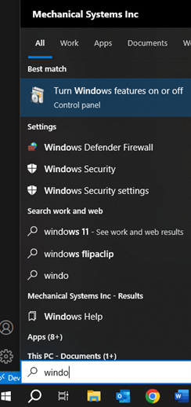
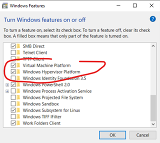
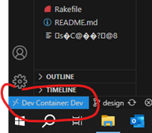
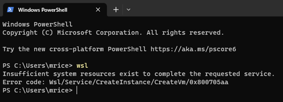
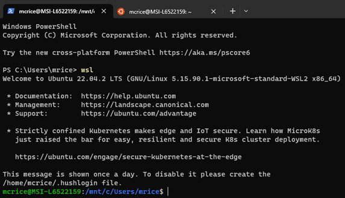
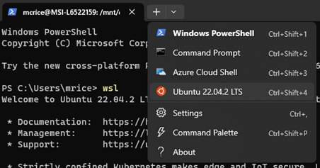
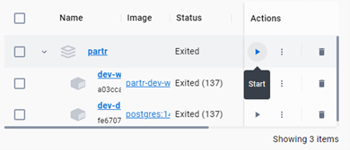
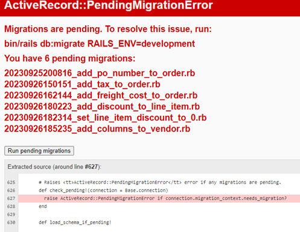

# README

(optional)Rails Setup:

- procedure/advice from the rails book is good
- https://docs.google.com/document/d/15_FSWdVHzFQwZppRTfoMoA0nawgiNjT64W9Rcgm-w-Q/edit?usp=sharing

## Docker setup:
- Install WSL2 and Ubuntu
- Install Docker Desktop
    - check "Enable integration with my default WSL distro" in settings > resources
        - enable integration with Ubuntu
    - Enable "Use WSL 2 Based Engine" in settings > general
- Install the Dev Containers extension in VSCode

## Installation Troubleshooting
In order for WSL and Docker to work, make sure to check the following:

### Install Docker
Run the following commands in your terminal power shell:
`ls -lrth docker.sock`
`sudo groupadd docker`
`sudo usermod -aG docker [username]`

### Update WSL to version 2
`wsl --update`

### Windows Features
Open the Windows start menu and search for “Turn Windows features on or off”.

Scroll down and enable “Virtual Machine Platform” and Windows Hypervisor Platform.

### Docker Extension
On VS Code, click the blue button on the bottom left of the window, pictured below (text may be different):

Scroll and select “Dev Container: Dev”

## Daily Routine

### Open Terminal
Run command `wsl`.
If you get the following error message, try restarting your device and repeating the previous instruction.

You should get the following success message:

### Open Ubuntu terminal for git and rails commands
On the terminal, click the down arrow at the top of the window (next to the open tab) and select the Ubuntu option. This should open a new tab with Ubuntu in the title.

In the Ubuntu tab, navigate to the project folder.
`cd partr`

### Open Docker Desktop and start the project

### Open VS Code
Open the project folder and make your edits in the files of your choice. You can view your local edits on a browser with the url http://127.0.0.1:3000/.

### Run compiler
Some edits won’t appear right away and need to be compiled first. If you make any edits to stylesheets or javascript files, **run the following command in the VS Code terminal:**
`bin/rails assets:precompile`

### Restart Docker Container
**Make sure to precompile your assets before proceeding.** In your Ubuntu terminal, end the existing process with `ctrl + C` if one is already running. Then run the following commands:
`bin/docker dev build`
`bin/docker dev up`

### Migrate Database
Suppose you start up the docker container and the webpage looks like this:

The database tables have changed, now you need to migrate those changes. In the VS Code terminal, run the following command:
`bin/rails db:migrate`

## Docker containers:

- `bin/docker [dev|test|prod] [build|up|down|exec] <optional parameter 1> <optional parameter 2>`
    - saves some time on docker compose commands
    - `ex. bin/docker dev up -d executes: docker compose -f docker-compose.test.yml up -d`
- `bin/test`
    - starts up the test container and runs `bin/rails test:all` then closes the test container
    - if run with `-i` will open up a shell prompt instead. Closes the container on exit

after cloning from github:
- Open the partr folder in VSCode
- Open default.dev.env, edit as needed and save as .dev.env
- Run `bin/docker dev build`
  - if it fails with "could not connect to deb.debian.org" just wait a bit and try again
- Click the blue square in the bottom left for remote connections
    - select "Reopen in Container"
    - if that fails try opening the container with `bin/docker dev up` to get more clear error messages.
      - if the error message is "network [random looking string] not found" try the command with --force-recreate
- develop from inside the container (open terminal in VS Code and run the following commands)
    - `rails db:setup` or:
        - `rails db:create`
        - `rails db:migrate`
        - `rails db:seed`
    - `rails assets:precompile`
    - `bin/dev`
        - starts the web server with the instructions in Procfile.dev
    - add any needed extensions to .devcontainer/devcontainer.json
    - despite the warning message, it should have access to your .ssh folder so you can do all git commands from within the container
      - if your .ssh folder hasn't been copied to /root/.ssh in the container click the blue box in the bottom left corner while the container is open and select "rebuild container"

before commit:
- `rails test:all`
- `bin/lint` or:
    - `bin/bundler-audit --update`
    - `bin/brakeman -q -w2`
    - `bin/rubocop --parallel` (`-A` to have rubocop fix offenses for you)